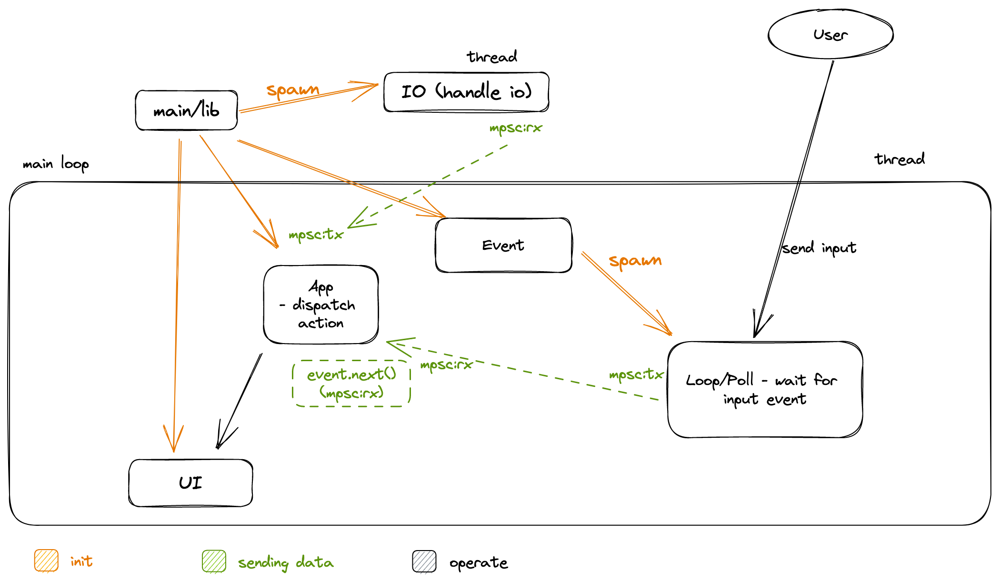

# Jackdull

- I got bootstrap from [plop-tui]( https://github.com/ilaborie/plop-tui), hoping the integration between tokio and tui will ease my development
- texts got from [anarchist library](https://theanarchistlibrary)

## Architecture

## how to play/interact (for now)
- clone this repo
- `cargo run`

## Todo
- [x] can type
- [x] after finish then calculate wpm
- [x] time up!
- [ ] menu ui
- [ ] fix calculating wpm, it seems double calculating
- [ ] more texts
- [ ] maybe loading text from website ?
- [ ] make it up to cargo, so can install via `cargo install`